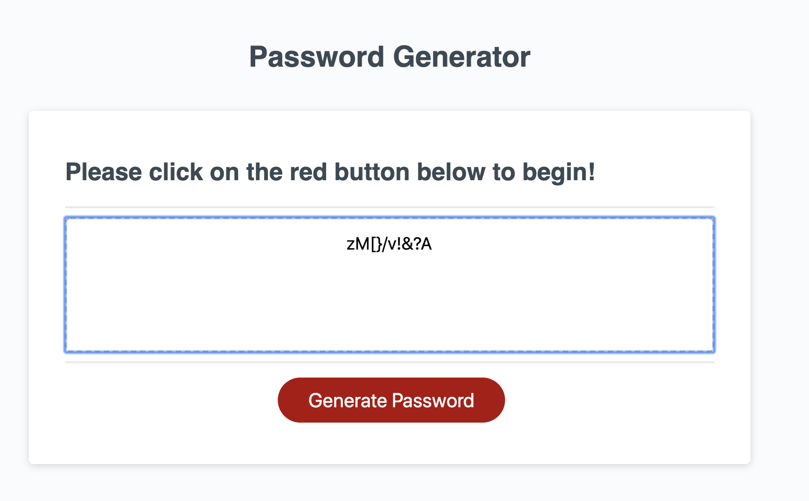
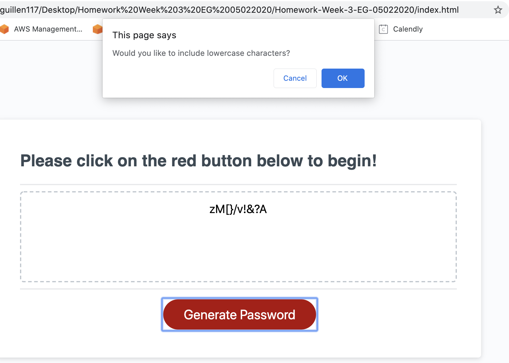
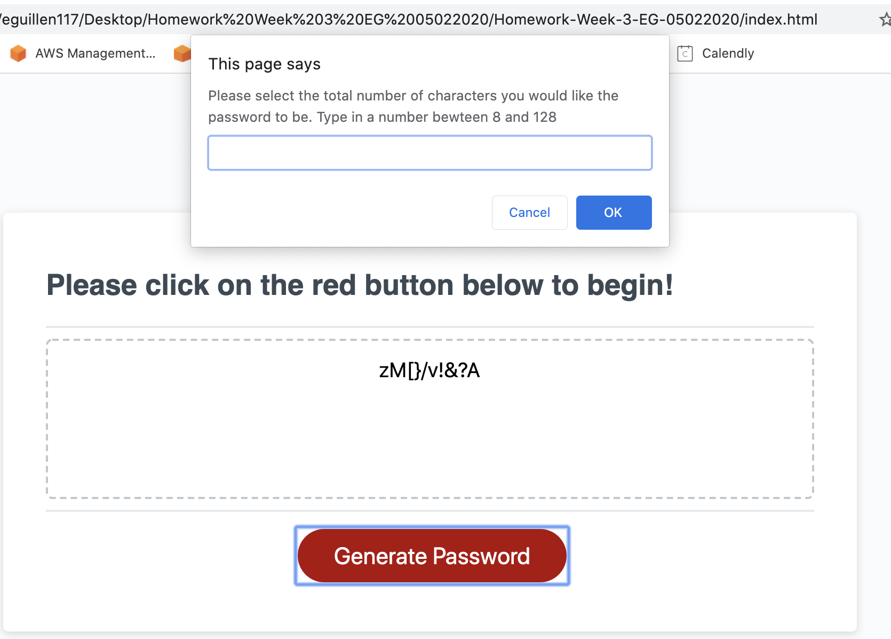

# Unit 03 Password Generator Homework

For this homework assisgnment we are tasked to create responsive Password Generator page using Javascript. 

## Getting Started

To access the webpages please visit https://eguillen2305.github.io/JS-Password-Generator/

### Screenshots and Examples

## Built With Visual Studio Code

* [VCS]
* [JavaScript]
* [CSS and HTML]

## Authors

* **Eduardo Guillen ** - [UTSA BCS](https://github.com/eguillen2305

## License

This project is licensed under the MIT License - see the [LICENSE.md](LICENSE.md) file for details

## Acknowledgments

* Hat tip to Joe Exotic
* My dog, Elise
